# Convmed
worlds first social media platform for sharing analyzed health records, chest x-rays and medical reports
# Inspiration
Social medias like instagram, facebook and whatsapp has become our day to day life and we are even so attached to the user experience of these social media applications. We thought what if we can develop a social media application for hospitals which can be used exclusively to analyse-share-save health records, chest X-Rays and medical records
# What it does
**ConvMed** is a social media mobile application built on **kotlin** for hospitals to analyze Electronic Health Records, medical tests, Chest X-Rays, etc powered by AWS Comprehend, AWS Lambda and AWS EC2. The analysed results are stored as comments in the post and  can be accessed by doctors, lab assistants any other healthcare workers within the hospitals protecting the privacy.
# App 
The app is available as **apk** inside apk folder.
# Architecture
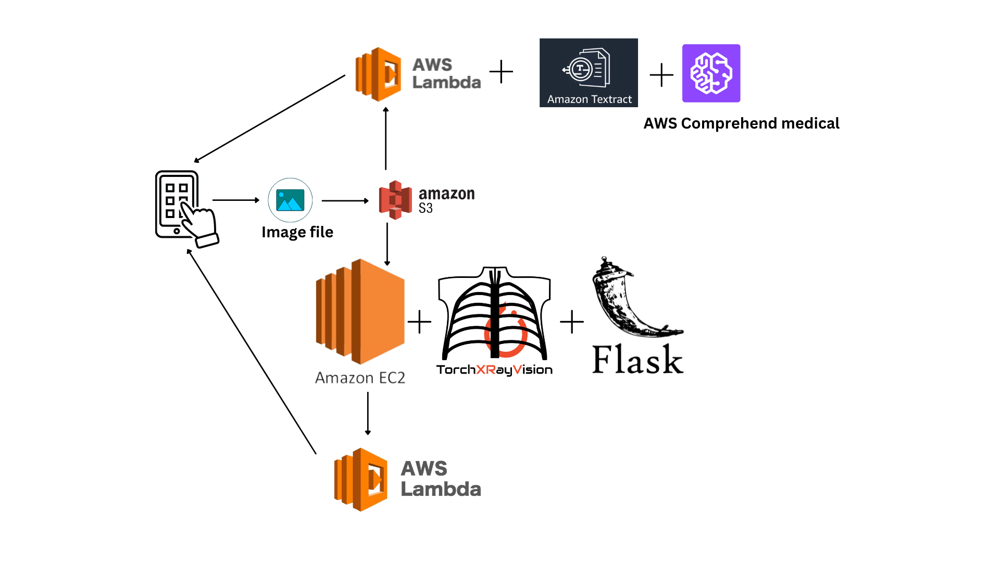

# Usage Of AWS Comprehend and other AWS Services 
## Document Analysis
When user upload an image without switch toggle for chest x-ray detection the image gets uploaded to AWS S3 using cognito pool id in kotlin, with the filename as firebase uid. Then a lambda function will be triggered using API Gateway using the image filename and the image passed through AWS Textract and the returned text string passed to AWS Comprehend with indents are returned as response for the mobile application.
```
./lambdafunctions/comprehendfunc.py
```
## Chest X-Ray
We deployed flask application on AWS EC2 instance using Gunicorn and nginx with **torchxrayvision** library support. **TorchXRayVision** is an open source software library for working with chest X-ray datasets and deep learning models. It provides a common interface and common pre-processing chain for a wide set of publicly available chest X-ray datasets including famous datasets such as MIMIC-CXR (MIT) and NIH chest X-ray8. In addition, a number of classification and representation learning models with different architectures, trained on different data combinations, are available through the library to serve as baselines or feature extractors.
When user select and click on analyze button with toggle switch on the image uploaded to aws s3 using cognito pool id in kotlin, with the filename as firebase uid. Then a lambda function will be triggered using API Gateway with AWS EC2 instance url(flask app) along with parameter.
```
./lambdafunctions/Chestxray.py
```

The Flask Sever App

```
./ec2app/application.py
```

It will return 18 classes

Atelectasis
Cardiomegaly
Consolidation 
Edema 
Effusion
Emphysema 
Enlarged_Cardiomediastinum 
Fibrosis
Fracture
Hernia
Infiltration 
Lung_Lesion 
Lung_Opacity 
Mass 
Nodule 
Pleural_Thickening 
Pneumonia 
Pneumothorax 


 # Screenshots
 ||||
|:----------------------------------------:|:-----------------------------------------:|:-----------------------------------------: |
| 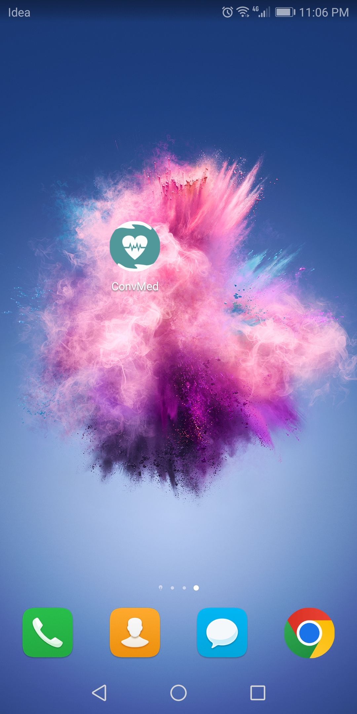 | 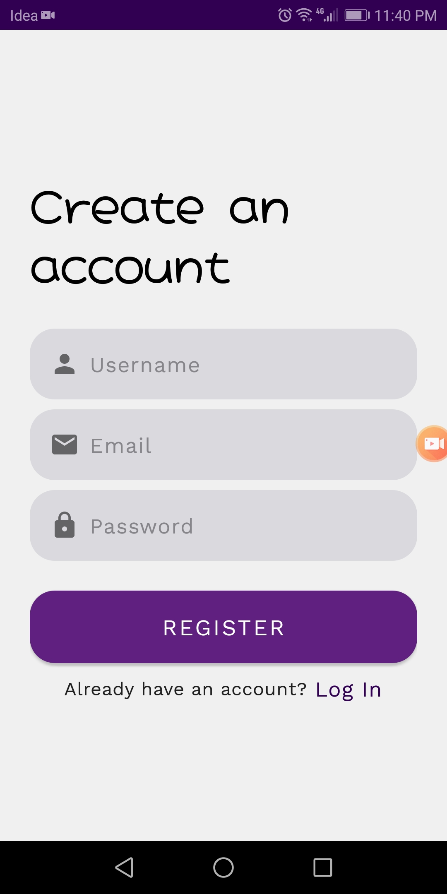 | 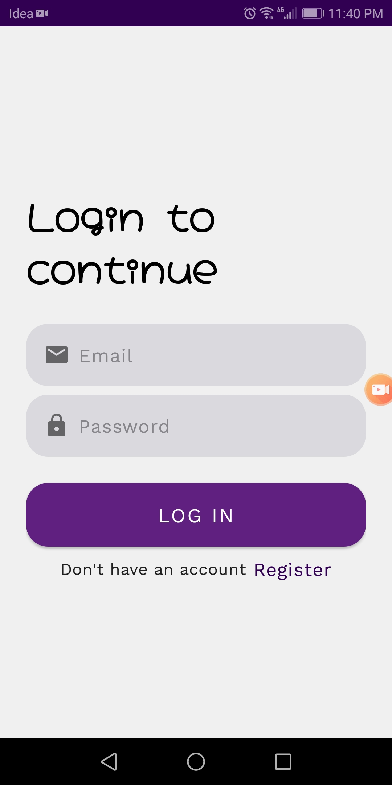 |
|  | 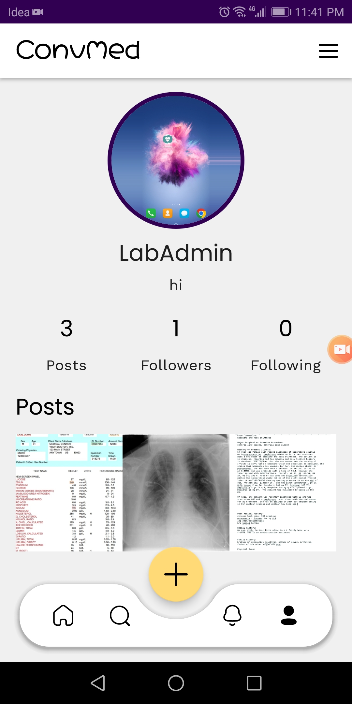 | 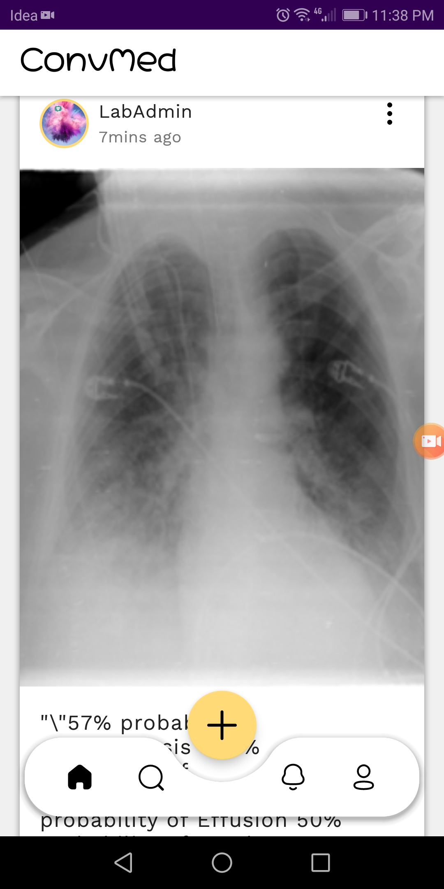 |
| 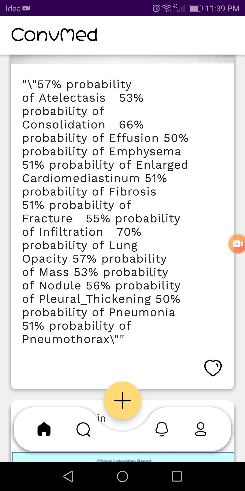 | 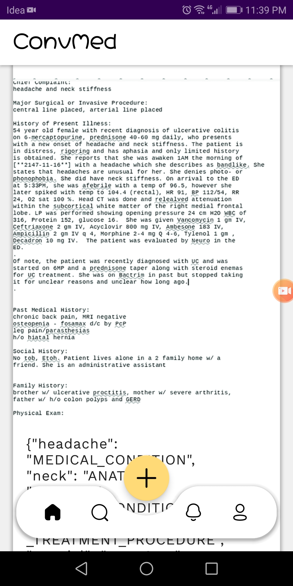 | 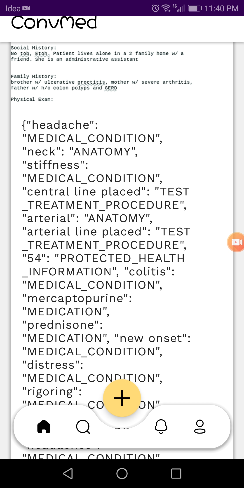 |
| 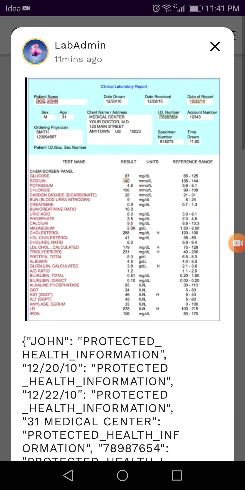 | 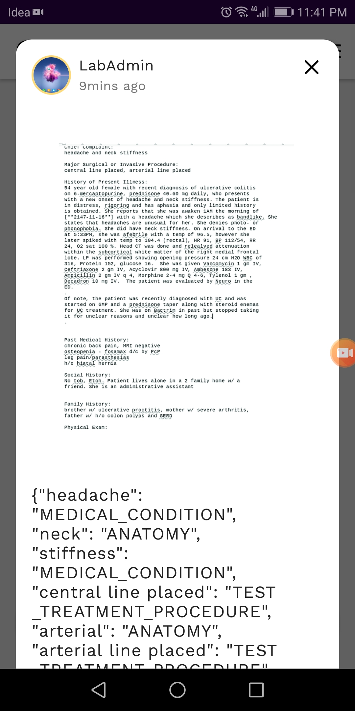 | 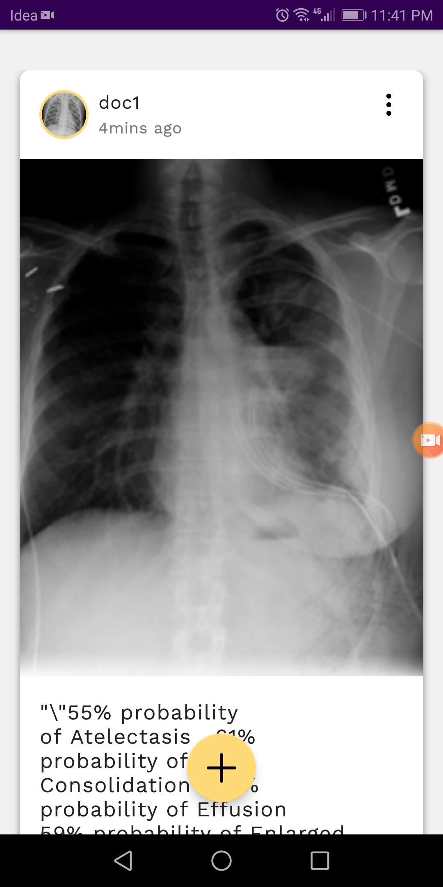 |


## App is Built With 🛠
- [Kotlin](https://kotlinlang.org/) - First class and official programming language for Android development.
- [Coroutines](https://kotlinlang.org/docs/reference/coroutines-overview.html) - For asynchronous and more..
- [Flow](https://kotlin.github.io/kotlinx.coroutines/kotlinx-coroutines-core/kotlinx.coroutines.flow/-flow/) - A cold asynchronous data stream that sequentially emits values and completes normally or with an exception.
- [Android Architecture Components](https://developer.android.com/topic/libraries/architecture) - Collection of libraries that help you design robust, testable, and maintainable apps.
  - [LiveData](https://developer.android.com/topic/libraries/architecture/livedata) - Data objects that notify views when the underlying database changes.
  - [ViewModel](https://developer.android.com/topic/libraries/architecture/viewmodel) - Stores UI-related data that isn't destroyed on UI changes. 
  - [ViewBinding](https://developer.android.com/topic/libraries/view-binding) - Generates a binding class for each XML layout file present in that module and allows you to more easily write code that interacts with views.
  - [DataBinding](https://developer.android.com/topic/libraries/data-binding) - Binds data directly into XML layouts
- [Dependency Injection](https://developer.android.com/training/dependency-injection) - 
  - [Hilt-Dagger](https://dagger.dev/hilt/) - Standard library to incorporate Dagger dependency injection into an Android application.
  - [Hilt-ViewModel](https://developer.android.com/training/dependency-injection/hilt-jetpack) - DI for injecting `ViewModel`.
- [Backend](https://firebase.google.com) - Google Firebase
  - Firebase Auth - To support email based authentication
  - AWS DynamoDB - A NoSQL database to store all data 
  - AWS S3 - A cloud storage to store all images
  - AWS Comprehend - A cloud service to analyse medical text
  - AWS Textract - Document to text OCR cloud service
  - AWS EC2- Cloud based virtual computers
- [Retrofit](https://square.github.io/retrofit/) - A type-safe HTTP client for Android and Java.
- [GSON](https://github.com/google/gson) - A modern JSON library for Kotlin and Java.
- [Timber](https://github.com/JakeWharton/timber) - A simple logging library for android.
- [GSON Converter](https://github.com/square/retrofit/tree/master/retrofit-converters/gson) - A Converter which uses Moshi for serialization to and from JSON.
- [Glide](https://github.com/bumptech/glide) - An image loading library for Android backed by Kotlin Coroutines.
- [Material Components for Android](https://github.com/material-components/material-components-android) - Modular and customizable Material Design UI components for Android.
